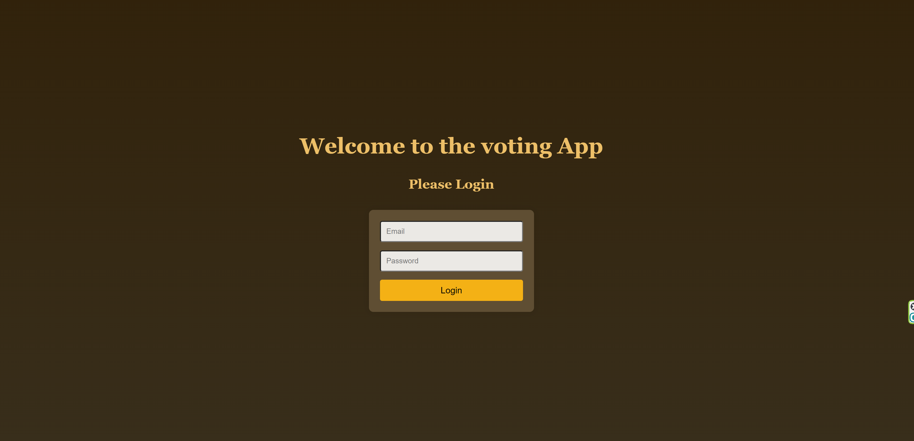

# Vote-Now

Vote for your favorite cat!

## Site's Link
[Vote For Your Favorite Location!](https://sifadovote.netlify.app/login/)

## About
This is a phone-responsive voting site built using React. The application features a login page, a voting section for vacation locations, and an admin panel for more advanced features. 

### Features
- **Login System:** Utilizes mockapi for user data.
- **Voting Page:** Allows users to vote for their favorite locations. Users can change their vote anytime.
- **Admin Panel:** Accessible by admin users for additional functionalities, including viewing all accounts and their voting status.

### Login Credentials

#### Admin Access
- Username: liron@gmail.com
- Password: 12

#### User Access
- Username: lin@gmail.com
- Password: 12

_More users are available in the API, accessible from the admin panel._

## Site's Preview
  

## Note
This site is a work in progress and may contain some bugs.

## Languages and Tools
- JavaScript
- CSS
- HTML

## Acknowledgements
- This project is hosted on Netlify.
- User data managed via mockapi.

## Contributing
Contributions, issues, and feature requests are welcome. Feel free to check [issues page](link-to-your-repo-issues) if you want to contribute.

## Author
- Liron Sifado - [GitHub Profile](https://github.com/LironSif/Voting-App)

